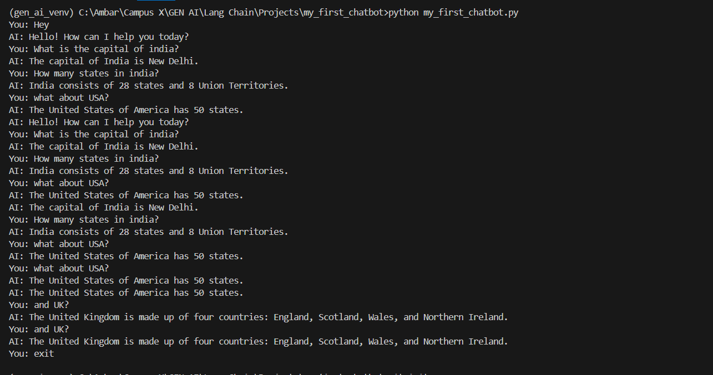

# GPT-4 Command-Line Chatbot

## Project Overview

This is a simple yet powerful **command-line chatbot** built using **LangChain** and **OpenAI's GPT-4** model. The chatbot maintains conversation history and allows for multi-turn dialogue through a persistent memory structure. It runs directly in your terminal, making it lightweight and beginner-friendly.

## Key Features

- 💬 Interactive chatbot using GPT-4  
- 🧠 Maintains conversation history for context-aware replies  
- 🛠 Built with LangChain's `ChatOpenAI` and message classes  
- 🔐 Secure API key management with `.env`  
- 🖥 Runs entirely in your terminal  

## Technologies Used

- **LangChain**
- **OpenAI GPT-4**
- **Python**
- **python-dotenv**

---

## How It Works

1. The chatbot is initialized with a `SystemMessage` to define behavior.  
2. It stores conversation turns using `chat_history`.  
3. On every user input, a `HumanMessage` is added.  
4. GPT-4 responds via `ChatOpenAI`, and the response is stored as an `AIMessage`.  
5. Typing `exit` ends the session.

---

